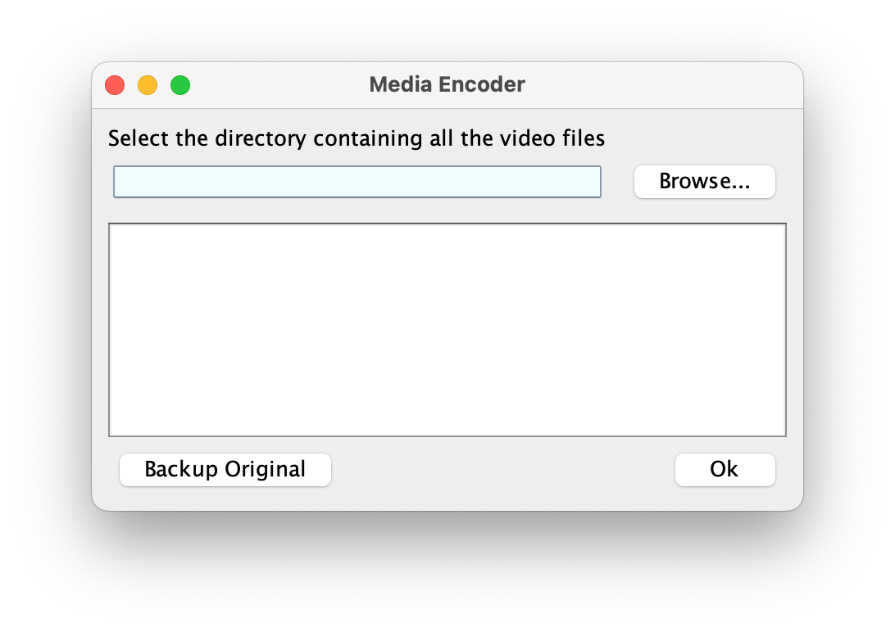
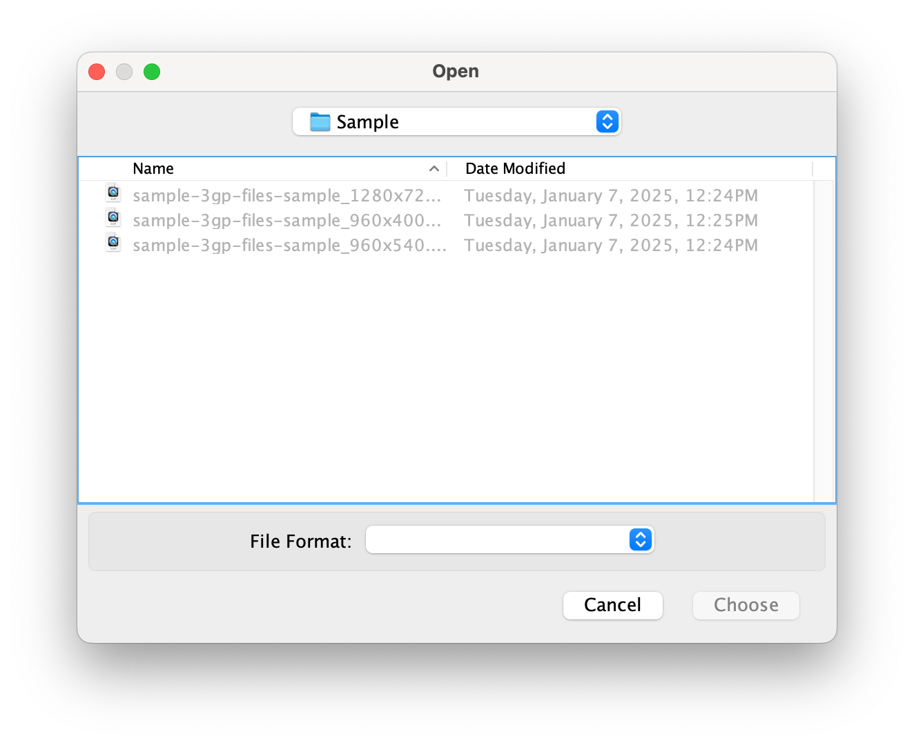

# Media Encoder

**Media Encoder** is a desktop application for converting old 3GP videos into MP4 format while preserving essential metadata such as **created** and **modified** dates. The application ensures that your media files stay well-organized and retain their original attributes. It uses **Java Swing** for the GUI and **FFmpeg** for the encoding process.

## Features

- **Metadata Preservation**: Keeps original **created** and **modified** dates.
- **Quality Retention**: Maintains the original bitrate and framerate during conversion.
- **Cross-Platform**: Runs on Windows and macOS.
- **User-Friendly GUI**: Intuitive interface built with Java Swing.
- **Maven Support**: Simplified build and dependency management.

## Screenshots




## Requirements

- **Java**: Version 8 or later.
- **Maven**: To build and manage dependencies.
- **FFmpeg**: Must be downloaded or built separately and placed in the appropriate directory:
    - **Windows**: `/ffmpeg/win`
    - **macOS**: `/ffmpeg/mac`

You can download FFmpeg from [FFmpeg.org](https://ffmpeg.org).

## Getting Started

### 1. Clone the Repository
Clone this repository to your local machine:
```bash
git clone https://github.com/your-username/media-encoder.git
cd media-encoder
```

### 2. Set Up FFmpeg
Download or build FFmpeg and place the executable in:
- **Windows**: `/ffmpeg/win/`
- **macOS**: `/ffmpeg/mac/`

Ensure the `ffmpeg` executable is correctly named and has executable permissions.

### 3. Build the Project
Use Maven to build the project:
```bash
mvn clean package
```
This will create a JAR file in the `target` directory.

### 4. Run the Application
Run the application using Maven:
```bash
mvn exec:java
```

Alternatively, you can run the JAR file directly:
```bash
java -jar target/mediaEncoder-1.0-SNAPSHOT.jar
```

### 5. Convert Videos
- Open the application.
- Select the directory where your video files reside.
- Click "Ok" to begin the conversion process. The original metadata and video quality will be preserved.

## Dependency Details

The project uses the [net.bramp.ffmpeg](https://github.com/bramp/ffmpeg-cli-wrapper) library for interfacing with FFmpeg. The Maven dependency is included in the `pom.xml`:

```xml
<dependency>
    <groupId>net.bramp.ffmpeg</groupId>
    <artifactId>ffmpeg</artifactId>
    <version>0.6.1</version>
</dependency>
```

## Limitations

- FFmpeg is not bundled with the application and must be set up manually due to its GPL license.
- Built with Java Swing, which may have some visual inconsistencies depending on the runtime environment.

## License
This project is licensed under the MIT License. See the `LICENSE` file for details.

## Contributing
Contributions are welcome! Feel free to fork this repository, create a new branch, and submit a pull request.
